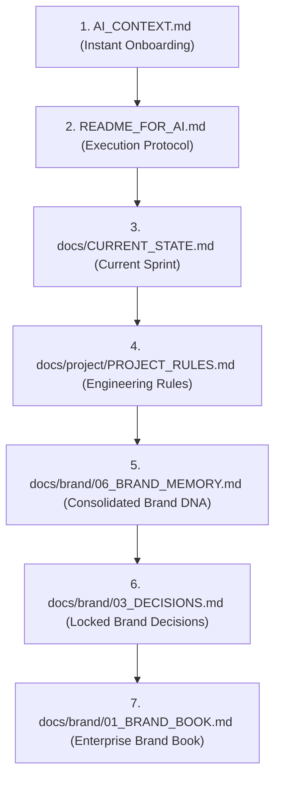

# AI Assistant Onboarding & Execution Guide (`README_FOR_AI.md`)

> **Notice for AI Assistants:** This document is your operational manual for contributing to the **Raghad Commerce Platform (RCP)** repository. Follow these protocols strictly during every session.

---

## 1. Recommended AI Reading Order

When initializing a new session or context window, read files in this exact sequence:

---

## 2. Single Source of Truth (SSOT) & Documentation Rules

1. **Every Fact Has Exactly ONE Owner Document:**
   - Business & governance state → `docs/project/PROJECT_STATE.md`
   - Master Brand Guidelines → `docs/brand/01_BRAND_BOOK.md`
   - Brand Memory & DNA → `docs/brand/06_BRAND_MEMORY.md`
   - Brand Decision Ledger → `docs/brand/03_DECISIONS.md`
   - Project Decision Ledger → `docs/project/PROJECT_DECISIONS.md`
   - Design System Tokens → `docs/design/`
   - Platform Research → `research/SUMMARY.md`

2. **Cross-Referencing Policy:**
   - Do NOT duplicate content across files.
   - When referencing information from an owner document, use markdown links pointing directly to the canonical file (e.g., `[`01_BRAND_BOOK.md`](file:///C:/abdo/Projects/raghad-commerce-platform/docs/brand/01_BRAND_BOOK.md)`).

3. **No Hallucination Rule:**
   - Never invent business logic, supplier names, margins, or founder decisions. If a detail is missing, mark it in `docs/brand/04_OPEN_ITEMS.md` as an open question.

---

## 3. Archive & Deprecation Policy

- **Never Delete Project Knowledge:** If a file or document is superseded by a newer version, move the older file to `docs/archive/`.
- **Archive Naming Standard:** Append `_SUPERSEDED` or descriptive suffix (e.g., `BRAND_BOOK_v1.0_SUPERSEDED.md`).
- **Archive References:** Ensure archived files contain a banner at the top linking to the active canonical document.

---

## 4. Update & Maintenance Policy

When completing any significant task or milestone, perform the following updates before ending your response:

1. **Update `docs/CURRENT_STATE.md`:** Update active phase, completed work, and current sprint.
2. **Update `CHANGELOG.md`:** Add a new entry under the unreleased or current semantic version following [Keep a Changelog](https://keepachangelog.com/) format.
3. **Audit Cross-Links:** Verify that file references remain valid and unbroken.

---

## 5. Decision Prefix & Registry Standards

Always log new project decisions using standardized ID prefixes:

- `BRAND-XXX` → Strategic brand decisions (`docs/brand/03_DECISIONS.md`)
- `BUS-XXX` → High-level business strategy decisions (`docs/project/PROJECT_DECISIONS.md`)
- `TECH-XXX` → Technical & architectural decisions (`docs/project/PROJECT_DECISIONS.md`)
- `DESIGN-XXX` → Visual identity & UI system decisions (`docs/project/PROJECT_DECISIONS.md`)
- `OPS-XXX` → Operational & supply chain decisions (`docs/project/PROJECT_DECISIONS.md`)

---

## 6. AI Operational Checklists

### Before Writing/Modifying Files:
- [ ] Have I identified the canonical owner document for this information?
- [ ] Is this change consistent with locked decisions in `docs/brand/03_DECISIONS.md`?
- [ ] Am I updating existing documents cleanly instead of creating duplicate files?

### After Completing Work:
- [ ] Did I update `docs/project/PROJECT_STATE.md`?
- [ ] Did I record the change in `CHANGELOG.md`?
- [ ] Did I verify no broken file links remain?
