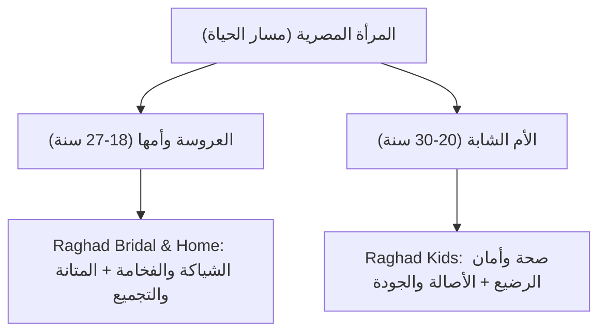
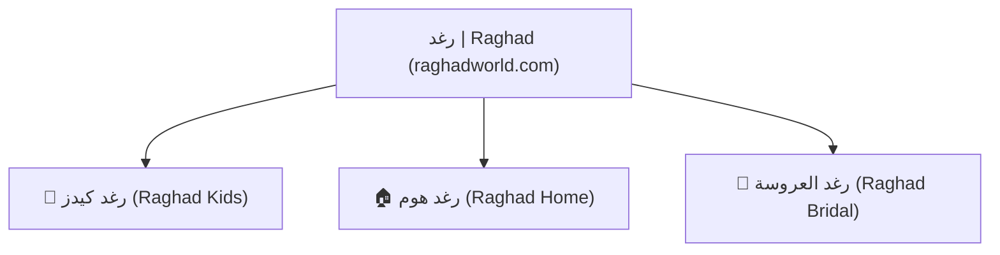

# دليل العلامة التجارية المؤسسي — النهائي
# RAGHAD ENTERPRISE BRAND BOOK

> **Status:** Officially Approved Baseline  
> **Version:** 2.0 (Zero-Based Rebuild)  
> **Master Brand Name:** رغد | Raghad  
> **Domain:** `raghadworld.com` / `raghad.eg`  
> **Tagline:** *"رغد... هتشتري وأنتي مغمضة"*  

---

## 1. الملخص التنفيذي والسبب الجوهري (Executive Summary & Brand Purpose)

هذه الوثيقة هي الدستور الاستراتيجي والتنفيذي الحاكم لعلامة **"رغد | Raghad"**. تم بناء هذا البراند وفق أعلى معايير استشارات العلامات التجارية العالمية (Enterprise Branding) كمنظومة حية تُعبر عن الأمان، الشفافية، والأناقة العائلية المريحة.

### 🎯 السبب الجوهري لوجود البراند (The Simon Sinek WHY)

> **بيان السبب الجوهري (Brand Purpose Statement):**  
> *"تأسست 'رغد' لتكون الملاذ الآمن والوجهة الموثوقة للمرأة المصرية؛ لتلغي تماماً الخوف من الخديعة الإلكترونية وتنهي التشتت بين المتاجر، بتوفير مستلزمات حقيقية، صادقة، وتكاملية ترافِقها في تجهيز بيتها ورعاية طفلها بلا مفاجآت."*

---

## 2. الرؤية المستقبلية والمعيار الذهبي (Brand Vision & Golden Standard)

تسعى "رغد" لقيادة سوق التجزئة الإلكترونية والتجربة العائلية في مصر عبر إرساء نموذج صارم وموثوق.

> **الرؤية الاستراتيجية (Brand Vision Statement):**  
> *"أن نصبح خلال 7 سنوات الوجهة الإلكترونية والتجربة العائلية الأولى الأكثر ثقة في مصر، عبر المنصة الرائدة وسلسلة الفروع التفاعلية التي تُرسي 'المعيار الذهبي للشفافية والجودة'، وتلغي الخديعة من تجربة الشراء المصرية."*

---

## 3. الرسالة والالتزامات التشغيلية (Brand Mission)

> **الرسالة التشغيلية (Brand Mission Statement):**  
> *"مهمتنا اليومية في 'رغد' هي تقديم تجربة تسوق موثوقة وعملية للمرأة المصرية، عبر انتقاء منتجات عالية الجودة تحل مشكلاتها الواقعية، وتوثيقها بصرياً بدقة وصدق تام، وخضوع كل طلب لفحص دقيق ومباشر قبل الشحن لضمان سلامته ومطابقته المطلقة."*

### 🛠️ الركائز التشغيلية الثلاث:
1. **الفرز الانتقائي العملي (Practical Curation):** اختيار ما يحل مشكلة العروسة والأم بأسلوب عملي وجودة حقيقية (معيار Neoflam/Chicco).
2. **التوثيق البصري الصادق (HD Real Media):** إظهار خامات وتفاصيل المنتج كما هي على الطبيعة بلا تجميل صناعي أو فلاتر الذكاء الاصطناعي.
3. **الفحص والتدقيق المسبق (Zero-Defect Quality Control):** فحص كل قطعة في المخزن قبل التغليف لضمان سلامتها ومطابقتها 100% لطلب العميل.

---

## 4. القيم الجوهرية ودستور اتخاذ القرار (Core Values Framework)

| م | القيمة | التطبيق العملي اليومي | قاعدة إدارة الأزمات |
| :--- | :--- | :--- | :--- |
| 1 | **الشفافية المطلقة** | ما تراه عين العميلة هو ما تلمسه يدها 100%؛ بلا فلاتر ولا تضليل. | إظهار أي عيب خامة أو معلومة بوضوح قبل الشراء. |
| 2 | **تحمل المسؤولية الكاملة** | تطبيق مبدأ: *"العميل لا يدفع ثمن خطئنا"*. | استبدال فوري مجاني على حساب المتجر لأي قطعة متضررة. |
| 3 | **الانتقاء بعين الخبير** | اختيار المنتجات التي تحل مشكلة حقيقية وتتمتع بجودة نرتضيها لأهلنا. | رفض أي منتج رديء حتى لو كان عالي الربحية. |
| 4 | **الأمان وراحة البال** | توفير حق المعاينة قبل الدفع ودعم سريع لإلغاء أي توتر. | المندوب ينتظر المعاينة الكاملة قبل استلام النقدية. |

---

## 5. الجمهور المستهدف وشخصيات المشتري (Target Personas)

### 👩‍💼 Persona 1: الأم الشابة (The Young Mother)
- **العمر:** 20 - 30 سنة (طفل أول أو ثانٍ).
- **النطاق الجغرافي:** القاهرة الكبرى (القاهرة والجيزة) والمحافظات الرئيسية.
- **الفئة الاقتصادية:** الطبقة المتوسطة وفوق المتوسطة (B / B+).
- **المحرك الشرائي الأول:** الأصالة والجودة لحماية صحة وسلامة طفلها الرضيع.

### 👰 Persona 2: العروسة وأمها (The Bride-to-be & Her Mother)
- **العمر:** 18 - 27 سنة (تشتري بصحبة والدتها).
- **المرحلة الحياتية:** تجهيز شقة الزوجية ("جهاز العروسة").
- **المحرك الشرائي الأول:** 
  - *العروسة:* التباهي البصري والأناقة أمام الضيوف ("الشياكة").
  - *الأم:* متانة الخامة، الأصالة، وتوفير عناء اللف والتشتت بين المحلات.

---

## 6. درع إزالة المخاطر وزيادة التحويل (Risk Reversal CRO Framework)

لتجاوز الحاجز النفسي الأول في مصر (الخوف من النصب والخديعة الإلكترونية)، يعتمد المتجر **"درع الثقة الثلاثي"**:

1. **حق المعاينة الكاملة قبل الدفع:** فتح الطرد وفحص المنتجات أمام مندوب الشحن قبل دفع أي مبلغ نقدي.
2. **فيديو الواقعية المباشر (HD Real-Product Clips):** مقاطع فيديو قصيرة 10 ثوانٍ واقعية وغير معدلة في صفحة كل منتج.
3. **ضمان الاستبدال الفوري المجاني:** استبدال مجاني عند باب المنزل خلال 48 ساعة لأي عيب تصنيع.

---

## 7. المصفوفة التنافسية ومواضع التفوق (Competitive Counter-Strike)

| تكتل المنافسين | ثغرتهم الكبرى | رد "رغد" التنافسي الحاسم |
| :--- | :--- | :--- |
| **Drop-shippers & Marketplaces** (أمازون/نون/تاجر) | عشوائية البائعين، المنتجات المجهولة، والمخالفة الشديدة للصور. | **المعاينة الصارمة قبل الدفع** والضمان المؤسسي الموحد. |
| **المتاجر المتخصصة** (الراية ستور وغيرها) | الاعتماد على صور الذكاء الاصطناعي (AI) التي تجمل المنتج على غير حقيقته. | **فيديوهات واقعية HD** غير معدلة تظهر الخامة واللون الحقيقي. |
| **سلاسل التجزئة الشعبية** (رنين) | العشوائية، انخفاض الجودة، والإنهاك في التجربة الفيزيائية. | **انتقاء فاخر (معيار Neoflam)** وتجميع الاحتياجات بلا تشتت. |

---

## 8. التموقع الاستراتيجي (Strategic Positioning)

### 🗣️ التموقع الشفهي على لسان العملاء (Word-of-Mouth Positioning):
> *"رغد هي المكان الوحيد اللي تشتري منه وانتي مغمضة؛ لأن المنتج بيوصل نفس الصورة 100%، وبتعاينيه وتتأكدي من خامته قدام المندوب قبل ما تدفعي جنيه واحد."*

### 🏢 التموقع المؤسسي (Corporate Positioning):
> *"المنصة العائلية الأولى في مصر المكرسة للمرأة (العروسة والأم)، التي تضمن المطابقة البصرية الصادقة والربط بين الانتقاء الفاخر وحق المعاينة قبل الدفع، لتمنح تسوقاً خالياً من الخديعة والتشتت."*

---

## 9. معمارية البراند والأركان الثلاثة (Brand Architecture)

نعتمد نموذج **"البيت الموحد" (Monolithic Branded House)** تحت مظلة استثمارية واحدة:

* **دومين موحد:** `raghadworld.com`
* **سلة شراء واحدة ودعم واتساب موحد.**
* **استغلال دورة حياة العميل (Customer LTV):** تتحول العروسة تلقائياً من شراء مستلزمات المنزل والتجهيز إلى شراء مستلزمات طفلها الأول دون مغادرة المنظومة.

---

## 10. الشعار والوعد الترويجي (Brand Tagline & Dual-Layer Promise)

* **الشعار الرئيسي (Main Tagline):**
  > **"رغد... هتشتري وأنتي مغمضة"**

* **الوعد التوضيحي المكمل (Sub-Promise):**
  > *"صورة حقيقية 100% | معاينة كاملة قبل الدفع | جودة تعيش معكِ ومع عائلتكِ"*

---

## 11. عرض القيمة الفريد (Unique Value Proposition - UVP)

> **[1. انتقاء فاخر بمعيار Neoflam/Chicco] + [2. أسعار عادلة بفضل التوريد المباشر من ميت الخولي] + [3. تجربة صفر-مخاطرة بالمعاينة قبل الدفع والفيديو الحقيقي]**

---

## 12. شخصية البراند والنبرة (Brand Personality & Voice)

### 👩‍🏫 النمط الإنساني (Brand Archetype):
**"الأخت الكبرى الخبيرة والموثوقة" (The Wise Older Sister)**
* صريحة، ذات ذوق رفيع، حريصة ومجربة، ومطمئنة غير ملحة في البيع.

### 🎙️ صوت ونبرة الخطاب (Brand Voice):
* **النبرة:** دافئة، راقية، بمزيج مصري معاصر محترم (بدون عامية هابطة وبدون لغة عربية جافة).

| Do's (ما يجب فعله) | Don'ts (ما يجب تجنبه) |
| :--- | :--- |
| ✅ استخدام مصطلحات دافئة محترمة ("نورتينا"، "بيتك وزوجيتك"). | ❌ استخدام شعارات رخيصة ("لحق العرض المجنون"، "أقوى خصم"). |
| ✅ التركيز على الفائدة العملية للمنتج في حل المشكلة. | ❌ الإلحاح في البيع أو ادعاء التخفيضات الوهمية. |
| ✅ التأكيد الدائم على حق المعاينة وواقعية الصور. | ❌ استخدام صور معدلة بالذكاء الاصطناعي تغير شكل المنتج. |

---

## 13. قصة نشأة البراند (Conversational Origin Story)

1. **المشكلة:**  
   *"قصتنا بدأت من نفس الحيرة والتعب اللي بتعيشه كل عروسة بتجهز بيتها، وكل أم بتدور على أمان طفلها في مصر: لف وتشتت بين عشرات المحلات، وخوف دائم من الشراء أونلاين بين صور متجملة ومعدلة بالـ AI... ومنتجات بتصدمك أول ما تفتحي العلبة!"*
2. **الشرارة:**  
   *"من هنا قررنا نغيّر اللعبة تماماً. جمعنا بين توريد مباشر من قلب المصادر لضمان أسعار عادلة، وبين انتقاء صارم لأعلى خامات الجودة (زي نيو فلام وشيكو). وحطينا شرط مفيش فيه فصال: كل قطعة بتتفحص بإيدينا قبل ما تطلع، وبنصورها فيديو على الطبيعة بدون أي فلاتر."*
3. **المعنى والوعد:**  
   *"واخترنا اسم 'رغد' — لأن الرغد في لغتنا هو سعة العيش، والراحة، وطمأنينة البال اللي تستحقيها في بيتك ومع طفلك. وعدنا ليكي دايماً إنك تكوني معانا في أمان كامل... وتشتري وأنتي مغمضة."*

---

## 14. الرسائل التسويقية للأركان الثلاثة (Sub-Pillar Messaging)

1. **رغد كيدز (Raghad Kids):**
   * *العنوان الرئيسي:* **"لأن أمان طفلك مش مجال للتجربة"**
   * *المحتوى:* مستلزمات العناية والإطعام الأصلية 100% مع معاينة مباشرة وفيديوهات واقعية.
2. **رغد هوم (Raghad Home):**
   * *العنوان الرئيسي:* **"بيتك شيك وخامته تعيش العمر"**
   * *المحتوى:* أدوات المطبخ والمنظمات الفاخرة (معيار نيو فلام) بتوريد مباشر من ميت الخولي بدمياط.
3. **رغد العروسة (Raghad Bridal):**
   * *العنوان الرئيسي:* **"تجهيز بيتك من غير ما تلفي ولا تحتاري"**
   * *المحتوى:* حزم تجهيز العروسة الشيك التي ترضي ذوق العروسة أمام الضيوف وتضمن المتانة التي تطمئن الأم.

---

## 15. الهوية البصرية والتوجيه الفني (Visual Identity Specifications)

### 🎨 نظام الألوان الرسمي (Palette System):
- **اللون الرئيسي التوقيعي (Primary Brand Color):**  
  `#D48C80` (Warm Terracotta / Soft Rose) — يرمز للدفء العائلي والأنوثة الراقية.
- **اللون الثانوي التبايني (Secondary Contrast Color):**  
  `#2C2230` (Premium Slate Plum) — يعطي الفخامة والوضوح للنصوص والأزرار التفاعلية.
- **خلفية الشاشة (Surface Canvas):**  
  `#FAFAFA` (Warm Silk White) — مريح للبصر ويبرز صور المنتجات الحقيقية.
- **لون الثقة والمعاينة (Success/Trust Badge):**  
  `#10B981` (Forest Emerald) — لشارات المعاينة والتوصيل وتأكيد الأمان.
- **لون التنبيه للعربون (Deposit Warning):**  
  `#F59E0B` (Amber Gold) — لتنبيهات جدية الحجز الهادئة.

### 🔤 الخطوط والتدرج البصري (Typography Hierarchy):
- **الخط العربي الرئيسي:** `Cairo` (Google Fonts)
  - **العناوين الكبرى والأزرار:** Cairo Bold (700) / Extra Bold (800)
  - **النصوص الوصفية:** Cairo Medium (500)
- **الحواف والظلال (UI System):**
  - **Border Radius:** `12px` لبطاقات المنتجات، و`30px` للأزرار وشارات الثقة (Soft Modern Feel).
  - **Shadows:** ظلال ناعمة خفيفة `0 4px 20px rgba(0,0,0,0.05)`.
